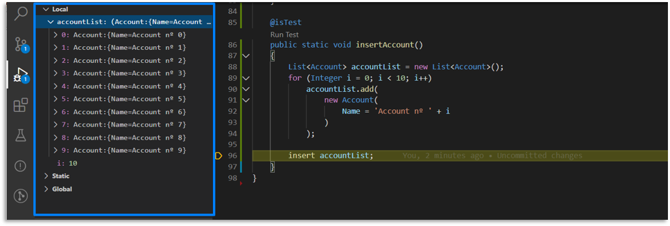

# Salesforce Apex Replay Debugguer

## Descripción
Proyecto configurado con Salesforce DX, es utilizado para realizar pruebas de depuración con Apex Replay Debugguer.
Para realizar la depuración es necesario desplegar el código a nuestra organización de pruebas, posteriormente se puede ejecutar este código desde la clase `ApexReplayDebugguerTest.cls`

### Requisitos

* Visual Studio Code
* Salesforce Extension Pack para Visual Studio Code
* Salesforce Org

## Instalación
Para realizar el despliegue de este código en nuestra organización es necesario tener previamente condifurado nuestro IDE Visual Studio Code y tener acceso a una Organización de login.salesforce.com
Pasos para realizar el despliegue de los recursos:

* Clonar el repositorio 
* Conectar el IDE con la Org de pruebas con la siguiente instrucción `sfdx force:auth:web:login -a connectionAlias`
* Desplegar los recursos a la organización con el comando `sfdx force:source:deploy -x .\manifest\package.xml -l RunAllTestsInOrg`